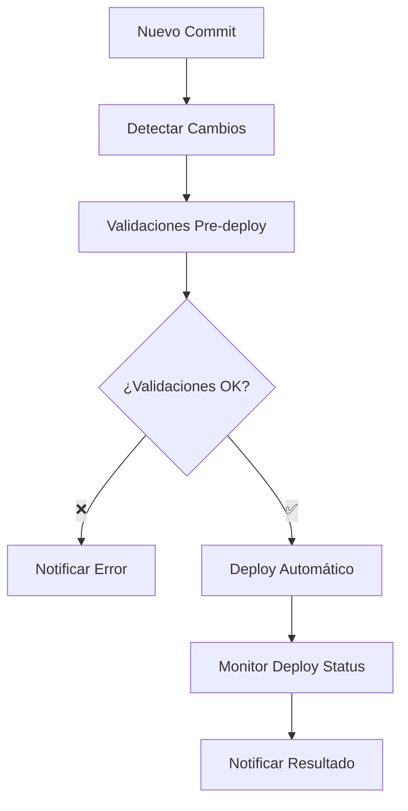

# 🚀 RENDER DEPLOY MONITOR AGENT

**Agente especializado que monitorea y asegura que los deploys de Render se activen automáticamente tras cambios en el repositorio.**

> Creado por **Task Master como arquitecto principal**

## 📋 ÍNDICE

- [Descripción General](#-descripción-general)
- [Características](#-características)
- [Instalación y Configuración](#-instalación-y-configuración)
- [Uso del Agente](#-uso-del-agente)
- [Componentes](#-componentes)
- [Dashboard Web](#-dashboard-web)
- [Variables de Entorno](#-variables-de-entorno)
- [Monitoreo y Logs](#-monitoreo-y-logs)
- [Troubleshooting](#-troubleshooting)

---

## 🎯 DESCRIPCIÓN GENERAL

Este agente integrado **monitorea automáticamente** los deploys de tu aplicación en Render.com y asegura que:

✅ **Los deploys se activen automáticamente** tras cada commit  
✅ **Las validaciones pre-deploy** se ejecuten correctamente  
✅ **Las notificaciones** se envíen en tiempo real  
✅ **El historial de deploys** se mantenga actualizado  

### Flujo Automático



---

## ⭐ CARACTERÍSTICAS

### 🔍 **Monitoreo Automático**
- Detecta nuevos commits en `main` branch
- Verifica que los deploys se activen en Render
- Monitoreo continuo cada 30 segundos

### ✅ **Validaciones Pre-Deploy**
- **Archivos requeridos**: `package.json`, `server.js`, `render.yaml`
- **Sintaxis JavaScript**: Validación de todos los archivos `.js`
- **Dependencias NPM**: Verificación de instalación correcta
- **Seguridad básica**: Detección de información sensible
- **Build simulation**: Prueba de construcción del proyecto

### 📢 **Sistema de Notificaciones**
- **Discord**: Webhooks para notificaciones en tiempo real
- **Slack**: Integración con canales de trabajo
- **Logs**: Historial completo de todos los eventos
- **Plantillas personalizadas** para cada tipo de evento

### 📊 **Dashboard y Reportes**
- **Dashboard web responsivo** con métricas en tiempo real
- **Historial de deploys** con estado y detalles
- **Métricas de validación** y tasa de éxito
- **Alertas visuales** para problemas críticos

---

## 🚀 INSTALACIÓN Y CONFIGURACIÓN

### Prerrequisitos

- ✅ **Node.js v16+** instalado
- ✅ **Git** configurado
- ✅ **Render.com** account con repositorio conectado
- ✅ **render.yaml** con `autoDeploy: true`

### Instalación

1. **Clonar el repositorio** (si no lo tienes):
   ```bash
   git clone https://github.com/mugentime/POS-CONEJONEGRO.git
   cd POS-CONEJONEGRO
   ```

2. **Instalar dependencias**:
   ```bash
   npm install
   ```

3. **Configurar variables de entorno** (opcional pero recomendado):
   ```bash
   # Para notificaciones Discord
   export DISCORD_WEBHOOK_URL="https://discord.com/api/webhooks/..."
   
   # Para notificaciones Slack  
   export SLACK_WEBHOOK_URL="https://hooks.slack.com/services/..."
   
   # Para verificaciones avanzadas (opcional)
   export RENDER_API_TOKEN="your-render-api-token"
   ```

---

## 🎮 USO DEL AGENTE

### Comandos Principales

#### 🚀 **Iniciar el Agente**
```bash
# Iniciar monitoreo continuo
node start-deploy-agent.js start

# Con opciones adicionales
node start-deploy-agent.js start --test-notifications --validate-on-start
```

#### 📊 **Verificar Estado**
```bash
# Mostrar estado completo del sistema
node start-deploy-agent.js status
```

#### ✅ **Ejecutar Validación Manual**
```bash
# Ejecutar todas las validaciones
node start-deploy-agent.js validate
```

#### 📢 **Test de Notificaciones**
```bash
# Probar sistema de notificaciones
node start-deploy-agent.js test-notifications
```

### Ejecución en Background

Para mantener el agente ejecutándose continuamente:

#### Windows PowerShell:
```powershell
Start-Job -ScriptBlock {
    Set-Location "C:\path\to\POS-CONEJONEGRO"
    node start-deploy-agent.js start
} -Name "RenderDeployAgent"
```

#### Linux/macOS:
```bash
# Con nohup
nohup node start-deploy-agent.js start > deploy-agent.log 2>&1 &

# Con screen
screen -S deploy-agent node start-deploy-agent.js start

# Con pm2 (recomendado para producción)
npm install -g pm2
pm2 start start-deploy-agent.js --name "render-deploy-agent" -- start
```

---

## 🧩 COMPONENTES

### 1. **RenderDeployMonitor** (`agents/render-deploy-monitor.js`)
- 🔍 Monitor principal de cambios en el repositorio
- ⏰ Verificación continua cada 30 segundos
- 📝 Detección de nuevos commits
- ✅ Verificación de estado de deploys

### 2. **DeployValidator** (`agents/deploy-validator.js`)
- 📋 Validaciones pre-deploy automáticas
- 🔧 Verificación de sintaxis y dependencias
- 🔒 Checks básicos de seguridad
- 📊 Sistema de puntuación de calidad

### 3. **DeployNotifier** (`agents/deploy-notifier.js`)
- 📢 Sistema de notificaciones multi-canal
- 🎨 Plantillas personalizadas para cada evento
- 📈 Historial de alertas
- 🔄 Retry automático en caso de fallos

### 4. **IntegratedDeployAgent** (`start-deploy-agent.js`)
- 🎯 Orquestador principal
- 🔄 Integración entre todos los componentes
- ⚙️ Configuración centralizada
- 📊 Reportes integrados

---

## 🖥️ DASHBOARD WEB

### Acceso al Dashboard

Abrir `deploy-dashboard.html` en tu navegador para ver:

- 📊 **Estado del agente** en tiempo real
- 🔍 **Métricas de monitoreo** y validaciones
- 📈 **Historial de deploys** con estados
- ⚠️ **Alertas y notificaciones** recientes

### Características del Dashboard

- 🔄 **Auto-refresh** cada 30 segundos
- 📱 **Responsive design** para móviles
- 🎨 **Interfaz moderna** con indicadores visuales
- ⚡ **Controles interactivos** para validaciones y tests

---

## ⚙️ VARIABLES DE ENTORNO

### Notificaciones

```bash
# Discord (opcional)
DISCORD_WEBHOOK_URL="https://discord.com/api/webhooks/YOUR_WEBHOOK"

# Slack (opcional)  
SLACK_WEBHOOK_URL="https://hooks.slack.com/services/YOUR_WEBHOOK"

# Email (opcional)
EMAIL_NOTIFICATIONS="true"
SMTP_HOST="smtp.gmail.com"
SMTP_USER="your-email@gmail.com" 
SMTP_PASS="your-app-password"
NOTIFICATION_EMAIL="alerts@yourcompany.com"
```

### Configuración Avanzada

```bash
# API de Render (opcional - para verificaciones avanzadas)
RENDER_API_TOKEN="your-render-api-token"

# Webhooks de Render (opcional)
RENDER_WEBHOOK_URL="https://api.render.com/deploy/srv-..."

# Control de notificaciones
ENABLE_DEPLOY_NOTIFICATIONS="true"  # default: true
```

---

## 📋 MONITOREO Y LOGS

### Archivos de Log

El agente genera logs detallados en:

```
logs/
├── deploy-monitor.log      # Monitor principal
├── notifications.log       # Sistema de notificaciones
├── validation.log          # Validaciones pre-deploy
├── deploy-history.json     # Historial de deploys
├── validation-history.json # Historial de validaciones
└── alert-history.json      # Historial de alertas
```

### Análisis de Logs

```bash
# Ver logs en tiempo real
tail -f logs/deploy-monitor.log

# Filtrar errores
grep "ERROR\|❌" logs/*.log

# Ver últimos deploys
cat logs/deploy-history.json | jq '.deploys[0:5]'

# Verificar tasa de éxito de validaciones
node -e "console.log(JSON.stringify(require('./logs/validation-history.json'), null, 2))"
```

---

## 🔧 TROUBLESHOOTING

### Problemas Comunes

#### ❌ **"El agente no detecta cambios"**

**Soluciones:**
```bash
# 1. Verificar configuración de Git
git remote -v
git status

# 2. Verificar permisos
git fetch origin main

# 3. Reiniciar el agente
node start-deploy-agent.js status
```

#### ❌ **"Validaciones fallan"**

**Soluciones:**
```bash
# 1. Ejecutar validación manual
node start-deploy-agent.js validate

# 2. Verificar archivos requeridos
ls -la package.json server.js render.yaml

# 3. Verificar sintaxis
node -c server.js
```

#### ❌ **"Notificaciones no llegan"**

**Soluciones:**
```bash
# 1. Test de notificaciones
node start-deploy-agent.js test-notifications

# 2. Verificar webhooks
echo $DISCORD_WEBHOOK_URL
echo $SLACK_WEBHOOK_URL

# 3. Verificar logs
tail -f logs/notifications.log
```

#### ❌ **"Deploy no se activa en Render"**

**Soluciones:**
1. **Verificar render.yaml**:
   ```yaml
   services:
     - type: web
       autoDeploy: true  # ← Debe estar en true
       branch: main      # ← Branch correcto
   ```

2. **Verificar conexión GitHub-Render**:
   - Ir a Render Dashboard
   - Verificar que el repositorio esté conectado
   - Revisar los deploy hooks

3. **Verificar commits llegan a GitHub**:
   ```bash
   git push origin main
   ```

### Logs de Debug

Para obtener logs más detallados:

```bash
# Ejecutar en modo verbose
DEBUG=* node start-deploy-agent.js start

# Verificar estado detallado
node start-deploy-agent.js status > status-report.json
```

---

## 📞 SOPORTE

### Comando de Ayuda

```bash
node start-deploy-agent.js help
```

### Verificación de Sistema

```bash
# Verificar todos los componentes
node agents/render-deploy-monitor.js validate
node agents/deploy-validator.js validate  
node agents/deploy-notifier.js test
```

### Estado del Agente

```bash
# Reporte completo de estado
node start-deploy-agent.js status | jq '.'
```

---

## 🎉 **¡LISTO PARA USAR!**

Tu **Render Deploy Monitor Agent** está configurado y listo para:

✅ **Monitorear deploys automáticamente**  
✅ **Validar calidad del código**  
✅ **Notificar en tiempo real**  
✅ **Mantener historial completo**  

### Próximos Pasos

1. **Iniciar el agente**: `node start-deploy-agent.js start`
2. **Abrir el dashboard**: `deploy-dashboard.html`
3. **Configurar notificaciones**: Añadir webhooks de Discord/Slack
4. **Hacer un commit de prueba** para verificar el flujo completo

---

**🎯 Creado por Task Master como arquitecto principal**  
**📅 Versión 1.0 - Enero 2025**
